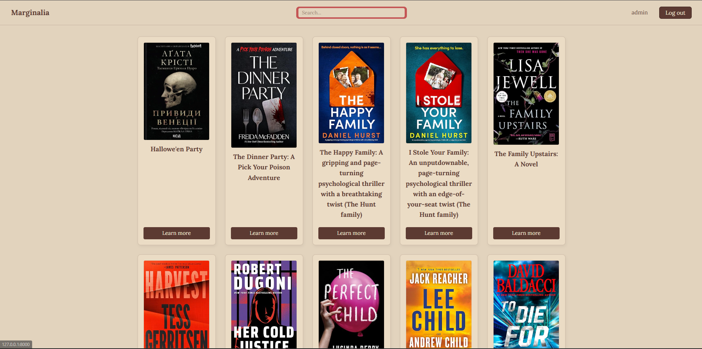
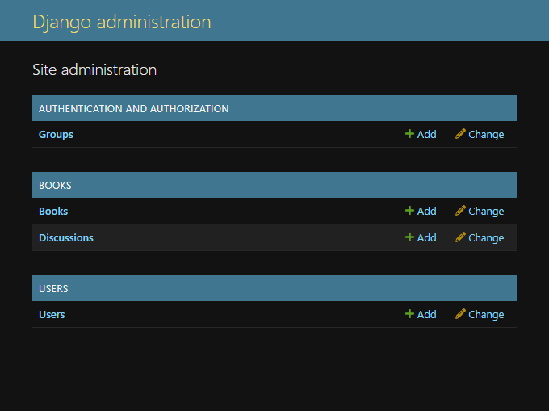

# 📖 Marginalia


Marginalia is a web platform designed for book lovers, where hundreds of users can read together, share thoughts on books, and discuss specific passages or pages right in the margins.

---

## 🚀 Live Demo

Here is a quick look at the main feature — interacting with the book text and creating discussions in real-time:

<p align="center">
  
</p>

### 📸 Screenshots

<table width="100%">
  <tr>
    <td width="50%" align="center"><b>Home Page</b></td>
    <td width="50%" align="center"><b>Django Admin Panel</b></td>
  </tr>
  <tr>
    <td></td>
    <td></td>
  </tr>
</table>

---

## 🛠️Technology stack

- Python 3.14+

- Django 6.0

- SQL Lite
---

## 💻 How to Run the Project Locally

Follow these steps to set up the "Marginalia" project on your computer:

### 1. Clone the Repository
First, clone this repository to your local machine and navigate to the project folder:
```bash
git clone [https://github.com/Corgi288/Marginalia.git](https://github.com/Corgi288/Marginalia.git)
cd Marginalia

2. Create and Activate a Virtual Environment (Recommended)
To ensure that the project's dependencies do not conflict with other system packages:

For Windows:
Bash
  python -m venv venv
  venv\Scripts\activate

For macOS/Linux:
Bash
  python3 -m venv venv
  source venv/bin/activate

3. Install Dependencies
Install all the necessary libraries and packages listed in the requirements.txt file:
Bash
pip install -r requirements.txt

4. Apply Database Migrations
Create the database structure before starting the server:
Bash
python manage.py migrate

5. Launch the Website
Start the Django local development server:
Bash
python manage.py runserver
Now, open your browser and go to http://127.0.0.1:8000/ to explore the website!
```

## Status
🚧 Project under development
